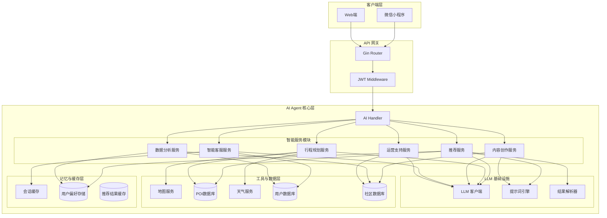
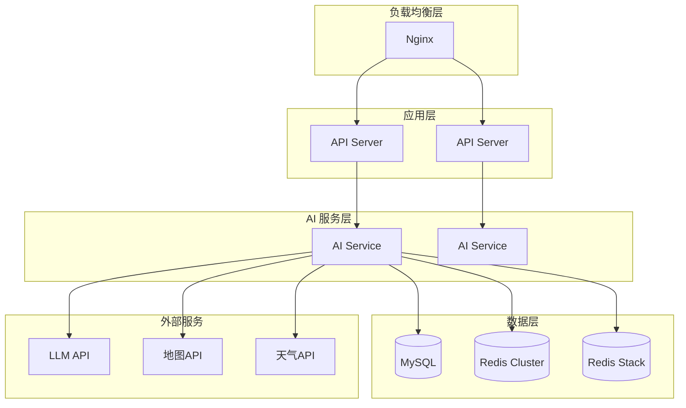

# 🤖 AI Agent 模块技术设计文档

> **文档版本**：v1.0  
> **创建日期**：2026-06-09  
> **适用项目**：迹忆旅图 (TrailMemo)  
> **作者**：@TPM

---

## 1. 需求分析

### 1.1 业务背景
基于「迹忆旅图」旅游平台的业务目标，AI Agent 模块旨在通过人工智能技术提升用户体验、增强平台智能化能力。

### 1.2 功能需求矩阵

| 需求分类 | 功能点 | 需求描述 | 优先级 |
|---------|--------|---------|--------|
| **智能推荐** | 场景化推荐 | 根据用户场景（周末短途/小长假/蜜月）推荐路线 | P1 |
| | 实时动态推荐 | 结合天气、节假日、热度调整推荐 | P1 |
| | 社交推荐 | 根据好友/关注用户行为推荐 | P2 |
| | 冷门目的地挖掘 | 推荐小众景点 | P2 |
| **行程规划** | 路线优化 | 自动优化节点顺序 | P1 |
| | 预算分配 | 根据预算分配费用 | P1 |
| | 时间规划 | 建议最佳游览时间 | P2 |
| | 备选路线 | 生成多条难度不同路线 | P2 |
| **内容创作** | 游记生成 | 根据打卡记录自动生成游记 | P1 |
| | 文案润色 | 优化分享内容 | P2 |
| | 攻略摘要 | 提取攻略精华 | P2 |
| **智能客服** | 自然语言问答 | 解答旅行相关问题 | P1 |
| | 行程提醒 | 推送出发提醒和天气预警 | P1 |
| | 紧急助手 | 提供紧急帮助信息 | P2 |
| **数据分析** | 偏好自动学习 | 从行为中学习偏好 | P1 |
| | 足迹分析 | 统计旅行数据 | P1 |
| | 趋势预测 | 预测潜在兴趣 | P2 |
| **运营支持** | 内容审核 | AI自动审核违规内容 | P1 |
| | 用户分层 | 根据行为特征分层 | P2 |
| | 异常检测 | 识别异常行为 | P2 |

### 1.3 非功能需求

| 类别 | 要求 |
|------|------|
| **性能** | API 响应时间 < 5s（AI推荐 < 10s） |
| **可用性** | 系统可用性 ≥ 99.5% |
| **并发** | 支持 1000+ QPS |
| **安全** | LLM 调用内容脱敏，敏感信息保护 |
| **降级** | LLM 不可用时返回预设数据 |

---

## 2. 架构设计

### 2.1 整体架构图



### 2.2 模块职责说明

| 模块 | 职责 | 核心能力 |
|------|------|---------|
| **AI Handler** | REST API 入口，参数校验与响应封装 | HTTP 请求处理 |
| **推荐服务** | 个性化旅游推荐 | 场景识别、偏好匹配、实时因子整合 |
| **行程规划服务** | 智能路线规划 | 路线优化、预算分配、时间规划 |
| **内容创作服务** | AI 辅助内容生成 | 游记生成、文案润色、攻略摘要 |
| **智能客服服务** | 自然语言交互 | 意图识别、问答、提醒推送 |
| **数据分析服务** | 用户行为分析 | 偏好学习、足迹统计、趋势预测 |
| **运营支持服务** | 平台运营辅助 | 内容审核、用户分层、异常检测 |
| **LLM 客户端** | 统一封装 LLM 服务商 | 多服务商切换、重试、降级 |
| **提示词引擎** | 提示词模板管理与渲染 | 动态参数填充、版本管理 |
| **结果解析器** | LLM 响应解析与结构化 | JSON 解析、错误处理 |
| **记忆系统** | 用户偏好与会话管理 | 分层存储、向量检索 |

### 2.3 关键设计决策

| 决策点 | 方案 | 理由 |
|--------|------|------|
| **LLM 集成方式** | 外部 API 调用 | 灵活性高、支持多服务商切换、成本可控 |
| **记忆存储** | Redis Stack + MySQL | 向量检索 + 结构化数据存储 |
| **缓存策略** | 多级缓存 | 会话缓存(短期) + 结果缓存(中期) + 偏好缓存(长期) |
| **降级方案** | 预设推荐数据 | LLM 不可用时保证服务可用性 |
| **监控体系** | OpenTelemetry + Prometheus | 分布式追踪 + 指标监控 |

---

## 3. 模块详细设计

### 3.1 LLM 客户端

**接口定义**：
```go
type LLMClient interface {
    Completion(prompt string, opts ...Option) (*CompletionResponse, error)
    Chat(messages []ChatMessage, opts ...Option) (*ChatResponse, error)
    Embedding(text string) ([]float64, error)
}

type CompletionResponse struct {
    Content     string
    Usage       TokenUsage
    FinishReason string
}

type ChatMessage struct {
    Role    string // "system", "user", "assistant"
    Content string
}
```

**支持服务商**：
- OpenAI (GPT-3.5/4)
- Claude (Anthropic)
- 硅基流动 (国内服务商)

**重试策略**：指数退避，最大重试 3 次

### 3.2 提示词引擎

**提示词模板结构**：
```go
type PromptTemplate struct {
    ID          string            // 模板唯一标识
    Name        string            // 模板名称
    Template    string            // 模板内容（支持{{变量}}替换）
    Parameters  []string          // 所需参数列表
    Version     string            // 版本号
    Category    string            // 分类：推荐/攻略/创作/客服
}
```

**推荐场景提示词示例**：
```
你是一位专业的旅游顾问。根据用户需求和偏好，生成个性化旅游推荐方案。

【用户需求】{{query}}
【预算范围】{{budget}}
【出行天数】{{days}}
【兴趣偏好】{{interests}}
【旅行类型】{{travel_type}}

请输出JSON格式，包含以下字段：
- title: 推荐名称（不超过20字）
- description: 推荐理由（不超过100字）
- destinations: 目的地列表（3-5个）
- budget: 预估费用（数字）
- route_template: {"nodes": [{"name": "...", "duration": "...", "activity": "..."}]}
- tags: 标签列表
```

### 3.3 记忆系统

**分层存储设计**：

| 层级 | 存储内容 | 存储介质 | 过期时间 |
|------|---------|---------|---------|
| 短期记忆 | 会话上下文 | Redis | 会话结束后 1 小时 |
| 工作记忆 | 当前任务状态 | Redis | 任务完成后 30 分钟 |
| 长期记忆 | 用户偏好、历史经验 | MySQL + Redis Stack | 永久 |

**用户偏好数据结构**：
```go
type UserPreference struct {
    UserID                uint64     // 用户ID
    TravelType            string     // 旅行类型：relax/adventure/couple/family
    BudgetRange           string     // 预算范围：low/medium/high/custom
    Interests             []string   // 兴趣标签：beach/food/culture/nature
    PreferredDestinations []string   // 偏好目的地
    AvoidDestinations     []string   // 避免目的地
    TravelFrequency       string     // 旅行频率：weekly/monthly/quarterly/yearly
    CompanionType         string     // 出行伙伴：alone/couple/family/friends
    CreatedAt             time.Time
    UpdatedAt             time.Time
}
```

### 3.4 工具调用框架

**工具注册机制**：
```go
type Tool interface {
    Name() string
    Description() string
    Parameters() []ToolParameter
    Execute(params map[string]interface{}) (interface{}, error)
}

type ToolParameter struct {
    Name        string
    Type        string // string/int/float/bool
    Required    bool
    Description string
}
```

**已注册工具**：

| 工具名称 | 功能 | 参数 |
|---------|------|------|
| MapSearch | 搜索地点 | keyword, city |
| POISearch | 搜索景点 | keyword, city, category |
| WeatherQuery | 查询天气 | city, date |
| RouteOptimize | 路线优化 | nodes, constraints |

---

## 4. API 接口设计

### 4.1 智能推荐接口

**POST /api/v1/ai/recommend**

**请求体**：
```json
{
  "query": "周末海边度假",
  "days": 2,
  "budget": "medium",
  "interests": ["beach", "food"],
  "travel_type": "relax"
}
```

| 字段 | 类型 | 必填 | 说明 |
|------|------|------|------|
| query | string | 是 | 用户需求描述 |
| days | int | 否 | 出行天数 |
| budget | string | 否 | 预算范围：low/medium/high/custom |
| interests | []string | 否 | 兴趣标签 |
| travel_type | string | 否 | 旅行类型 |

**响应体**：
```json
{
  "code": 200,
  "message": "success",
  "data": {
    "recommendations": [
      {
        "id": "uuid",
        "title": "三亚两日悠闲游",
        "description": "推荐理由：三亚拥有中国最美的海岸线...",
        "destinations": ["三亚湾", "亚龙湾", "蜈支洲岛"],
        "budget": 2500,
        "days": 2,
        "route_template": {
          "nodes": [
            {"name": "三亚湾", "duration": "2小时", "activity": "海滩漫步"},
            {"name": "亚龙湾热带天堂", "duration": "4小时", "activity": "热带雨林探秘"}
          ]
        },
        "tags": ["beach", "relax", "food"]
      }
    ]
  }
}
```

### 4.2 攻略生成接口

**POST /api/v1/ai/guide**

**请求体**：
```json
{
  "city": "杭州",
  "days": 3,
  "interests": ["culture", "food"]
}
```

**响应体**：
```json
{
  "code": 200,
  "message": "success",
  "data": {
    "city": "杭州",
    "days": 3,
    "overview": "杭州是一座充满诗意的城市...",
    "daily_itinerary": [
      {
        "day": 1,
        "title": "西湖经典一日",
        "spots": [
          {"name": "断桥残雪", "duration": "1小时", "tips": "建议早上去人少"},
          {"name": "雷峰塔", "duration": "2小时", "tips": "登塔俯瞰西湖"}
        ],
        "food_recommendation": "楼外楼 - 西湖醋鱼"
      }
    ],
    "accommodation": [
      {"name": "杭州西湖国宾馆", "price": "800", "location": "西湖边"}
    ]
  }
}
```

### 4.3 游记生成接口

**POST /api/v1/ai/content/travel-note**

**请求体**：
```json
{
  "route_id": 123,
  "style": "story", // story/journal/poetic
  "include_images": true
}
```

**响应体**：
```json
{
  "code": 200,
  "message": "success",
  "data": {
    "title": "我的三亚之旅",
    "content": "Day 1：清晨的三亚湾...",
    "images": ["https://...", "https://..."],
    "suggested_tags": ["三亚", "旅行日记", "海滩"]
  }
}
```

### 4.4 智能客服接口

**POST /api/v1/ai/chat**

**请求体**：
```json
{
  "message": "杭州明天天气怎么样？适合出行吗？",
  "session_id": "session-xxx"
}
```

**响应体**：
```json
{
  "code": 200,
  "message": "success",
  "data": {
    "reply": "杭州明天晴转多云，气温25-32°C，非常适合出行！记得做好防晒哦~",
    "intent": "weather_query",
    "session_id": "session-xxx"
  }
}
```

### 4.5 用户偏好接口

**GET /api/v1/ai/preferences**

**响应体**：
```json
{
  "code": 200,
  "message": "success",
  "data": {
    "travel_type": "relax",
    "budget_range": "medium",
    "interests": ["beach", "food", "culture"],
    "preferred_destinations": ["三亚", "杭州", "厦门"],
    "travel_frequency": "monthly"
  }
}
```

**PUT /api/v1/ai/preferences**

**请求体**：
```json
{
  "travel_type": "adventure",
  "budget_range": "medium",
  "interests": ["nature", "adventure"]
}
```

---

## 5. 数据库与数据结构设计

### 5.1 核心数据表

#### 5.1.1 user_preferences（用户偏好表）

| 字段名 | 类型 | 约束 | 说明 |
|--------|------|------|------|
| id | BIGINT | PK, AUTO_INCREMENT | 主键 |
| user_id | VARCHAR(36) | FK, UNIQUE | 用户ID |
| travel_type | VARCHAR(32) | | 旅行类型 |
| budget_range | VARCHAR(32) | | 预算范围 |
| interests | JSON | | 兴趣标签数组 |
| preferred_destinations | JSON | | 偏好目的地 |
| avoid_destinations | JSON | | 避免目的地 |
| travel_frequency | VARCHAR(32) | | 旅行频率 |
| companion_type | VARCHAR(32) | | 出行伙伴 |
| created_at | DATETIME | | 创建时间 |
| updated_at | DATETIME | | 更新时间 |

#### 5.1.2 recommendations（推荐记录表）

| 字段名 | 类型 | 约束 | 说明 |
|--------|------|------|------|
| id | VARCHAR(36) | PK | UUID |
| user_id | VARCHAR(36) | FK | 用户ID |
| query | TEXT | | 用户查询内容 |
| result | JSON | | 推荐结果 |
| expires_at | DATETIME | | 过期时间 |
| status | INT | DEFAULT 1 | 状态 |
| created_at | DATETIME | | 创建时间 |

#### 5.1.3 travel_guides（旅游攻略表）

| 字段名 | 类型 | 约束 | 说明 |
|--------|------|------|------|
| id | VARCHAR(36) | PK | UUID |
| user_id | VARCHAR(36) | FK | 用户ID |
| city | VARCHAR(64) | INDEX | 目标城市 |
| days | INT | | 游玩天数 |
| result | JSON | | 攻略内容 |
| expires_at | DATETIME | | 过期时间 |
| created_at | DATETIME | | 创建时间 |

#### 5.1.4 chat_sessions（会话记录表）

| 字段名 | 类型 | 约束 | 说明 |
|--------|------|------|------|
| id | VARCHAR(36) | PK | UUID |
| user_id | VARCHAR(36) | FK | 用户ID |
| messages | JSON | | 消息历史 |
| expires_at | DATETIME | | 过期时间 |
| created_at | DATETIME | | 创建时间 |
| updated_at | DATETIME | | 更新时间 |

### 5.2 Redis 缓存结构

| Key 格式 | Value 类型 | 过期时间 | 说明 |
|---------|-----------|---------|------|
| ai:session:{session_id} | JSON | 1小时 | 会话上下文 |
| ai:preference:{user_id} | JSON | 1小时 | 用户偏好缓存 |
| ai:recommend:{user_id}:{hash} | JSON | 30分钟 | 推荐结果缓存 |
| ai:guide:{city}:{days} | JSON | 12小时 | 攻略缓存 |
| ai:embedding:{content_hash} | JSON | 7天 | 内容向量缓存 |

---

## 6. 文件架构设计

### 6.1 整体项目结构

```
TrailMemo/                              # 项目根目录
├── backend/                            # Go 后端主服务
│   ├── cmd/
│   │   └── server/
│   │       └── main.go                 # 服务启动入口
│   ├── configs/
│   │   └── config.yaml                 # 配置文件
│   ├── internal/
│   │   ├── handler/                    # HTTP 处理层
│   │   │   ├── ai.go                   # AI 代理层
│   │   │   └── ...
│   │   ├── service/                    # 业务逻辑层
│   │   │   ├── ai_client.go            # AI 服务客户端
│   │   │   └── ...
│   │   ├── repository/                 # 数据访问层
│   │   ├── model/                      # 数据模型
│   │   ├── middleware/                 # 中间件
│   │   ├── router/                     # 路由配置
│   │   └── config/                     # 配置加载
│   ├── pkg/                            # 公共包
│   ├── docs/                           # Swagger 文档
│   └── uploads/                        # 上传文件存储
│
├── ai-service/                         # Python AI Agent 服务
│   ├── app/                            # 应用核心目录
│   │   ├── api/                        # API 路由层
│   │   │   └── v1/                     # API 版本控制
│   │   │       ├── recommend.py        # 智能推荐接口
│   │   │       ├── guide.py            # 攻略生成接口
│   │   │       ├── content.py          # 内容创作接口
│   │   │       ├── chat.py             # 智能客服接口
│   │   │       └── preferences.py      # 用户偏好接口
│   │   ├── core/                       # 核心模块
│   │   │   ├── llm_client.py           # LLM 客户端封装
│   │   │   ├── prompt_engine.py        # 提示词引擎
│   │   │   ├── memory_system.py        # 记忆系统
│   │   │   ├── tool_registry.py        # 工具注册中心
│   │   │   └── result_parser.py        # 结果解析器
│   │   ├── services/                   # 业务服务层
│   │   │   ├── recommendation_service.py   # 推荐服务
│   │   │   ├── planning_service.py         # 行程规划服务
│   │   │   ├── content_service.py          # 内容创作服务
│   │   │   ├── chat_service.py             # 智能客服服务
│   │   │   ├── analysis_service.py         # 数据分析服务
│   │   │   └── ops_service.py              # 运营支持服务
│   │   ├── tools/                      # 工具实现层
│   │   │   ├── map_tool.py             # 地图服务工具
│   │   │   ├── poi_tool.py             # 景点查询工具
│   │   │   ├── weather_tool.py         # 天气查询工具
│   │   │   └── route_tool.py           # 路线优化工具
│   │   ├── models/                     # 数据模型
│   │   │   ├── schemas.py              # Pydantic 验证模型
│   │   │   └── entities.py             # 业务实体模型
│   │   ├── prompts/                    # 提示词模板
│   │   │   ├── recommendation_prompt.txt   # 推荐场景模板
│   │   │   ├── guide_prompt.txt            # 攻略生成模板
│   │   │   ├── content_prompt.txt          # 内容创作模板
│   │   │   └── chat_prompt.txt             # 客服对话模板
│   │   ├── memory/                     # 记忆存储实现
│   │   │   ├── short_term_memory.py    # 短期记忆(会话缓存)
│   │   │   ├── long_term_memory.py     # 长期记忆(向量检索)
│   │   │   └── preference_store.py     # 偏好存储(数据库)
│   │   └── utils/                      # 工具函数
│   │       ├── config.py               # 配置加载
│   │       ├── logger.py               # 日志配置
│   │       ├── exceptions.py           # 自定义异常
│   │       └── decorators.py           # 装饰器工具
│   ├── tests/                          # 测试用例
│   │   ├── unit/                       # 单元测试
│   │   ├── integration/                # 集成测试
│   │   └── fixtures/                   # 测试数据
│   ├── config/                         # 配置文件
│   │   ├── settings.py                 # 配置类定义
│   │   └── prompt_templates/           # 提示词模板目录
│   ├── .env                            # 环境变量文件
│   ├── requirements.txt                # Python 依赖列表
│   ├── main.py                         # FastAPI 应用入口
│   └── Dockerfile                      # Docker 配置
│
├── frontend/                           # 前端小程序
├── deploy/                             # 部署配置
└── docs/                               # 项目文档
```

### 6.2 AI Service 目录职责说明

| 目录 | 职责 | 核心文件 |
|------|------|---------|
| **api/** | REST API 入口，处理 HTTP 请求 | `recommend.py`, `guide.py`, `chat.py` |
| **core/** | 核心基础设施，LLM 交互核心 | `llm_client.py`, `prompt_engine.py`, `memory_system.py` |
| **services/** | 业务逻辑层，实现各服务能力 | `recommendation_service.py`, `planning_service.py` |
| **tools/** | 外部工具封装，API 调用接口 | `map_tool.py`, `weather_tool.py`, `poi_tool.py` |
| **models/** | 数据模型定义，请求/响应结构 | `schemas.py`, `entities.py` |
| **prompts/** | 提示词模板存储，支持动态加载 | `recommendation_prompt.txt`, `guide_prompt.txt` |
| **memory/** | 记忆系统实现，分层存储管理 | `short_term_memory.py`, `long_term_memory.py` |
| **utils/** | 通用工具函数，辅助功能 | `config.py`, `logger.py`, `exceptions.py` |

### 6.3 核心文件详细说明

#### 6.3.1 入口文件

**`main.py`** - FastAPI 应用入口
```python
# 职责：初始化 FastAPI 应用，注册路由，启动服务
# 关键功能：
# - 加载配置
# - 初始化日志
# - 注册 API 路由
# - 启动 Uvicorn 服务
```

#### 6.3.2 核心模块

**`app/core/llm_client.py`** - LLM 客户端封装
```python
# 职责：统一封装多种 LLM 服务商，提供一致的 API 接口
# 支持服务商：
# - OpenAI (GPT-3.5/4)
# - Claude (Anthropic)
# - 硅基流动 (国内服务商)
# 核心功能：
# - 多服务商切换
# - 自动重试 (指数退避)
# - 请求超时控制
# - 降级方案支持
```

**`app/core/prompt_engine.py`** - 提示词引擎
```python
# 职责：提示词模板管理与动态渲染
# 核心功能：
# - 模板加载与缓存
# - 动态参数填充
# - 版本管理
# - 格式验证
```

**`app/core/memory_system.py`** - 记忆系统
```python
# 职责：分层记忆管理，支持会话和长期记忆
# 记忆层次：
# - 短期记忆：会话上下文 (Redis)
# - 工作记忆：当前任务状态 (Redis)
# - 长期记忆：用户偏好、历史经验 (MySQL + 向量数据库)
```

**`app/core/tool_registry.py`** - 工具注册中心
```python
# 职责：管理所有可用工具，支持动态注册和调用
# 核心功能：
# - 工具注册与发现
# - 参数校验
# - 统一调用接口
# - 错误处理
```

**`app/core/result_parser.py`** - 结果解析器
```python
# 职责：解析 LLM 响应，转换为结构化数据
# 核心功能：
# - JSON 格式解析
# - 错误处理与容错
# - 数据校验与清洗
```

#### 6.3.3 业务服务

**`app/services/recommendation_service.py`** - 推荐服务
```python
# 职责：智能推荐核心业务逻辑
# 核心功能：
# - 场景识别
# - 偏好匹配
# - 实时因子整合
# - LLM 调用与结果处理
```

**`app/services/planning_service.py`** - 行程规划服务
```python
# 职责：智能路线规划
# 核心功能：
# - 路线优化算法
# - 预算分配
# - 时间规划
# - 备选路线生成
```

**`app/services/content_service.py`** - 内容创作服务
```python
# 职责：AI 辅助内容生成
# 核心功能：
# - 游记自动生成
# - 文案润色
# - 攻略摘要
# - 图片推荐
```

**`app/services/chat_service.py`** - 智能客服服务
```python
# 职责：自然语言交互服务
# 核心功能：
# - 意图识别
# - 知识问答
# - 会话管理
# - 提醒推送
```

**`app/services/analysis_service.py`** - 数据分析服务
```python
# 职责：用户行为分析与洞察
# 核心功能：
# - 偏好自动学习
# - 足迹分析
# - 趋势预测
# - 影响力分析
```

**`app/services/ops_service.py`** - 运营支持服务
```python
# 职责：平台运营辅助
# 核心功能：
# - 内容审核
# - 热门预测
# - 用户分层
# - 异常检测
```

#### 6.3.4 工具实现

**`app/tools/map_tool.py`** - 地图服务工具
```python
# 职责：封装地图 API，提供地点搜索和路线查询
# 支持功能：
# - 地点搜索
# - 路线规划
# - 距离计算
```

**`app/tools/poi_tool.py`** - 景点查询工具
```python
# 职责：封装 POI 数据库，提供景点信息查询
# 支持功能：
# - 景点搜索
# - 分类筛选
# - 详情查询
```

**`app/tools/weather_tool.py`** - 天气查询工具
```python
# 职责：封装天气 API，提供天气预报
# 支持功能：
# - 实时天气
# - 未来预报
# - 天气预警
```

#### 6.3.5 数据模型

**`app/models/schemas.py`** - Pydantic 验证模型
```python
# 职责：定义 API 请求/响应的数据结构和验证规则
# 包含模型：
# - RecommendRequest/Response
# - GuideRequest/Response
# - ChatRequest/Response
# - PreferencesRequest/Response
```

**`app/models/entities.py`** - 业务实体模型
```python
# 职责：定义业务层数据实体
# 包含实体：
# - UserPreference (用户偏好)
# - Recommendation (推荐记录)
# - TravelGuide (旅游攻略)
# - ChatSession (会话记录)
```

#### 6.3.6 记忆存储

**`app/memory/short_term_memory.py`** - 短期记忆
```python
# 职责：管理会话级别临时数据
# 存储介质：Redis
# 过期策略：会话结束后 1 小时
```

**`app/memory/long_term_memory.py`** - 长期记忆
```python
# 职责：管理用户长期偏好和历史经验
# 存储介质：向量数据库 (Pinecone/Weaviate/Redis Stack)
# 核心功能：向量检索、相似度匹配
```

**`app/memory/preference_store.py`** - 偏好存储
```python
# 职责：管理用户偏好数据的持久化存储
# 存储介质：MySQL
# 核心功能：偏好读写、更新、查询
```

### 6.4 依赖与环境

#### 6.4.1 Python 依赖列表 (`requirements.txt`)

```txt
# 核心框架
fastapi==0.104.1
uvicorn==0.24.0
python-multipart==0.0.6

# LangChain 生态
langchain==0.1.0
langchain-openai==0.0.2
langchain-community==0.0.12
langsmith==0.0.83

# 向量数据库
pinecone-client==2.2.2
redis==5.0.1

# 数据处理
pydantic==2.5.2
python-dotenv==1.0.0
requests==2.31.0

# 日志与监控
structlog==23.2.0
prometheus-client==0.19.0

# 测试
pytest==7.4.4
pytest-asyncio==0.21.1
```

#### 6.4.2 环境变量配置 (`.env`)

```env
# LLM 配置
LLM_PROVIDER=openai
LLM_API_KEY=your-api-key-here
LLM_BASE_URL=https://api.openai.com/v1
LLM_TIMEOUT=30

# 向量数据库配置
PINECONE_API_KEY=your-pinecone-key
PINECONE_ENV=us-west1-gcp
REDIS_URL=redis://localhost:6379

# 外部 API 配置
MAP_API_KEY=your-map-api-key
WEATHER_API_KEY=your-weather-api-key

# 服务配置
API_HOST=0.0.0.0
API_PORT=8000
LOG_LEVEL=INFO
```

---

## 7. 部署与集成设计

### 7.1 部署架构



### 6.2 配置管理

**LLM 配置示例**：
```yaml
ai:
  llm:
    provider: openai  # openai/claude/guiji
    api_key: ${LLM_API_KEY}
    timeout: 30s
    max_retries: 3
    fallback_enabled: true
  
  cache:
    session_ttl: 1h
    preference_ttl: 1h
    recommend_ttl: 30m
    guide_ttl: 12h
  
  rate_limit:
    recommend: 100/1m
    chat: 50/1m
```

### 6.3 监控指标

| 指标名称 | 类型 | 说明 |
|---------|------|------|
| ai_request_count | Counter | AI 请求总数 |
| ai_success_count | Counter | 成功请求数 |
| ai_failure_count | Counter | 失败请求数 |
| ai_latency | Histogram | 请求延迟分布 |
| llm_call_count | Counter | LLM 调用次数 |
| llm_token_usage | Histogram | Token 使用量 |
| cache_hit_rate | Gauge | 缓存命中率 |
| degrade_count | Counter | 降级触发次数 |

---

## 7. 安全与合规

### 7.1 数据安全

| 措施 | 说明 |
|------|------|
| **敏感信息脱敏** | LLM 请求中不传递用户敏感信息 |
| **HTTPS 传输** | 所有接口使用 HTTPS |
| **API 密钥管理** | 使用环境变量管理密钥 |
| **内容安全检测** | 用户生成内容经过安全审核 |

### 7.2 合规要求

| 合规项 | 措施 |
|--------|------|
| **个人信息保护法** | 用户数据加密存储，明确数据用途 |
| **内容审核** | AI 生成内容需审核后发布 |
| **用户同意** | 明确告知用户 AI 服务使用方式 |
| **数据留存** | 会话记录定期清理，用户可删除 |

---

## 8. 代码安全性

### 8.1 注意事项

| 风险点 | 描述 | 关联模块 |
|--------|------|---------|
| **LLM 注入攻击** | 用户输入可能包含恶意提示词 | 提示词引擎 |
| **数据泄露** | LLM 可能记忆并泄露敏感信息 | LLM 客户端 |
| **资源耗尽** | 恶意请求导致 LLM 调用费用过高 | 所有服务 |
| **未经授权访问** | API 接口被非法调用 | AI Handler |
| **输出滥用** | AI 生成不当内容 | 内容创作服务 |

### 8.2 解决方案

| 风险点 | 解决方案 |
|--------|---------|
| **LLM 注入攻击** | 输入内容过滤、提示词模板固化、输出格式验证 |
| **数据泄露** | 不传递敏感信息给 LLM、使用企业级 LLM 服务 |
| **资源耗尽** | API 限流、请求配额管理、费用监控告警 |
| **未经授权访问** | JWT 鉴权、接口权限校验、IP 白名单 |
| **输出滥用** | 内容安全检测、敏感词过滤、人工审核兜底 |

---

## 9. 实施路线图

| 阶段 | 时间 | 目标 | 交付物 |
|------|------|------|--------|
| **Phase 1** | 2-3周 | 基础功能 | 推荐服务、攻略生成、偏好管理 |
| **Phase 2** | 2-3周 | 核心能力 | 行程规划、内容创作、智能客服 |
| **Phase 3** | 2周 | 数据分析 | 偏好学习、足迹分析 |
| **Phase 4** | 2周 | 运营支持 | 内容审核、用户分层 |
| **Phase 5** | 1-2周 | 优化迭代 | 性能优化、监控告警 |

---

*文档元数据：由 @TPM 生成 | 版本：v1.0 | 更新时间：2026-06-09*